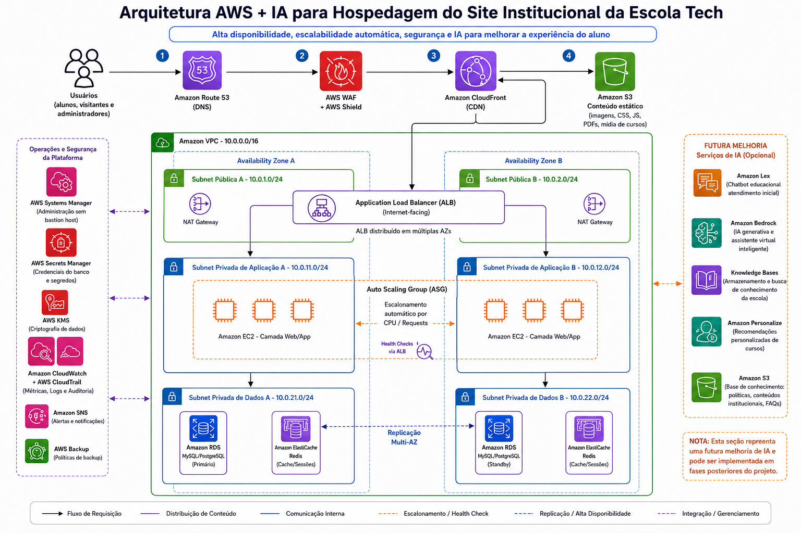

# Proposta de arquitura para a Escola Tech



### Componentes principais

| Camada | Servico | Funcao |
|---|---|---|
| DNS | Amazon Route 53 | Roteamento e failover de DNS |
| Borda | AWS WAF + Shield Standard | Firewall de aplicacao web e protecao DDoS |
| CDN | Amazon CloudFront + S3 | Cache global de conteudo estatico |
| Rede | VPC + Subnets + NAT Gateway | Isolamento e segmentacao de rede |
| Balanceamento | Application Load Balancer (ALB) | Distribuicao de trafego entre AZs |
| Compute | Amazon EC2 (t3.micro) | Servidores de aplicacao |
| Elasticidade | Auto Scaling Group (ASG) | Escala automatica por CPU e requisicoes |
| Banco de dados | Amazon RDS PostgreSQL Multi-AZ | Banco relacional com failover automatico |
| Identidade | AWS IAM | Controle de acesso e permissoes |
| Segredos | AWS Secrets Manager | Credenciais sem hardcode no codigo |
| Observabilidade | CloudWatch + SNS | Metricas, alarmes e notificacoes |
| Auditoria | AWS CloudTrail | Log de todas as acoes na conta |
| Backup | AWS Backup + RDS Snapshots | Recuperacao point-in-time |

---
## Seguranca em camadas (Defense in Depth)

```
Internet
   |
   [WAF] ← bloqueia SQL Injection, XSS, bots maliciosos (OWASP Top 10)
   |
   [Shield Standard] ← absorve ataques DDoS volumetricos (gratis)
   |
   [CloudFront] ← oculta o IP real do ALB, termina TLS na borda
   |
   [SG-ALB] ← aceita apenas 80/443 da internet
   |
   [SG-EC2] ← aceita apenas trafego originado do SG-ALB
   |
   [SG-RDS] ← aceita porta 5432 apenas do SG-EC2
   |
   [KMS] ← dados em repouso criptografados AES-256
   |
   [Secrets Manager] ← senha do banco nunca aparece no codigo
   |
   [CloudTrail] ← tudo logado, quem fez, o que, quando, de qual IP
```

**Principio aplicado:** Menor Privilegio — cada camada so conhece a anterior. O banco nunca e acessivel pela internet. As EC2 nunca sao acessiveis diretamente. O acesso administrativo e feito via SSM Session Manager, sem porta 22 exposta.

---